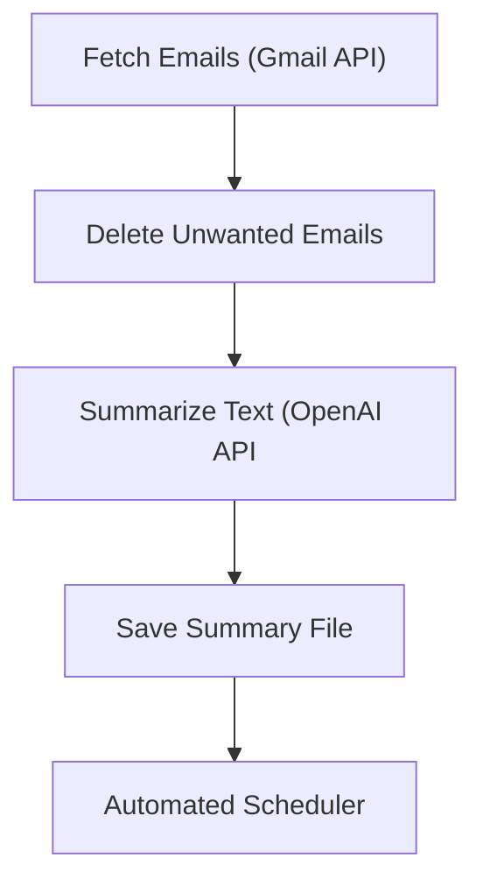

# Email Optimization Assistant

This project automates daily email summarization and organization using the Gmail and OpenAI APIs.

---

## Overview
- Extracts Gmail emails from the previous day (24hrs) using Google API  
- Deletes (moves to trash folder) unwanted emails (subscriptions, spams, social, promotions, notifications, and noreplys) to free up space
- Summarizes inbox emails using GPT-5 mini (OpenAI API)  
- Saves and emails a concise daily report  
- Runs automatically via launchd macOS scheduler

---
## Architecture

